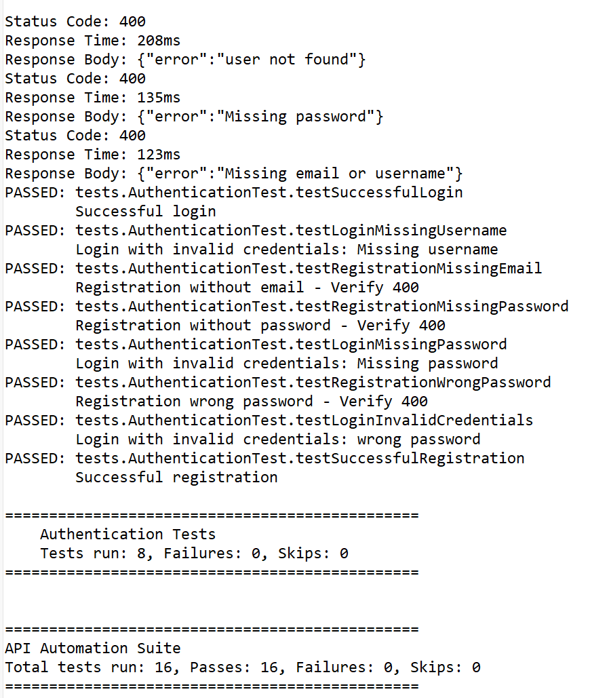

# REST API Test Automation with RestAssured

## 📋 Overview
Comprehensive API test automation framework using **RestAssured** and **TestNG**, refactored into a scalable **Layered Architecture**. Validates RESTful web services including CRUD operations, authentication, and response validation.

## 🛠️ Tech Stack
- **Language**: Java 11
- **API Testing**: RestAssured 5.4
- **Testing Framework**: TestNG 7.8
- **JSON Processing**: Jackson Databind 2.16
- **Build Tool**: Maven
- **API Endpoint**: https://reqres.in (Demo REST API)

## 🏗️ Layered Architecture
The project follows a clean separation of concerns with 6 distinct layers:

1. **Config Layer**: Centralized configuration for URLs, headers, and test data.
2. **Specifications Layer**: Reusable Request and Response specifications.
3. **Models Layer**: POJOs for type-safe JSON serialization/deserialization.
4. **Services Layer**: API endpoint wrappers (Business Logic).
5. **Utils Layer**: Helper classes for data generation and validation.
6. **Tests Layer**: Clean test cases focusing on assertions.

## 📁 Project Structure
```
restassured-api-automation/
├── src/
│   └── test/java/
│       ├── config/          # ApiConfig, HeaderConfig, TestConfig
│       ├── models/          # POJOs (User, AuthRequest, etc.)
│       ├── services/        # AuthService, UserService
│       ├── specifications/  # RequestSpecs, ResponseSpecs
│       ├── utils/           # TestDataGenerator, ResponseValidator
│       ├── base/            # BaseTest (Test setup)
│       └── tests/           # Actual Test Classes
│           ├── UserAPITest.java
│           └── AuthenticationTest.java
├── pom.xml
├── testng.xml
└── README.md
```

## ✨ Features
- **Type-Safe API Calls**: Uses POJOs instead of hardcoded JSON strings.
- **Reusable Services**: API calls are wrapped in service methods.
- **Centralized Config**: Easy to switch environments (DEV, QA, PROD).
- **Data Driven**: Test data generation utilities.
- **Detailed Reporting**: TestNG reports and logs.

## 🚀 Getting Started

### Prerequisites
- Java JDK 11 or higher
- Maven 3.6+

### Installation
```bash
git clone https://github.com/jodieweiwei-ship-it/restassured-api-automation.git
cd restassured-api-automation
mvn clean install
```

## 🔐 Configuration

### Environment Setup
Base URLs and endpoints are managed in `src/test/java/config/ApiConfig.java`.
You can switch environments by setting the `env` system property (default is PROD).

### Headers
Headers are managed in `src/test/java/config/HeaderConfig.java`.
Default headers include:
- `Content-Type: application/json`
- `x-api-key: reqres-free-v1`

### Test Data
Test credentials and data constants are in `src/test/java/config/TestConfig.java`.

## 🏃 Running Tests

Run all tests:
```bash
mvn test
```

Run specific test class:
```bash
mvn test -Dtest=UserAPITest
mvn test -Dtest=AuthenticationTest
```

## 📊 Test Coverage

### User API Tests (8 scenarios)
- ✅ GET - Retrieve list of users with pagination
- ✅ GET - Retrieve single user by ID
- ✅ GET - Handle non-existent user (404)
- ✅ POST - Create new user (using Builder pattern)
- ✅ PUT - Update existing user
- ✅ PATCH - Partial update user
- ✅ DELETE - Remove user
- ✅ Response time validation

### Authentication Tests (8 scenarios)
- ✅ Successful registration
- ✅ Registration validation (wrong password)
- ✅ Registration validation (missing password)
- ✅ Registration validation (missing email)
- ✅ Successful login
- ✅ Login with invalid credentials (wrong password)
- ✅ Login with invalid credentials (Missing password)
- ✅ Login with invalid credentials (Missing username)

## 📝 API Documentation
Using reqres.in demo API:
- Base URL: https://reqres.in/api
- Documentation: https://reqres.in/

## 👤 Author
Wei Wei (Jodie)
- LinkedIn: https://www.linkedin.com/in/wei-wei-jodie/
- Email: jodieweiwei@gmail.com

## 📄 License
This project is for educational and demonstration purposes.

## 📊 Test Results


