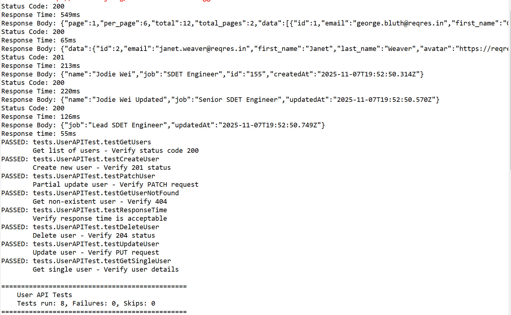

# REST API Test Automation with RestAssured

## 📋 Overview
Comprehensive API test automation framework using RestAssured and TestNG. Validates RESTful web services including CRUD operations, authentication, and response validation.

## 🛠️ Tech Stack
- **Language**: Java 11
- **API Testing**: RestAssured 5.4
- **Testing Framework**: TestNG 7.8
- **Build Tool**: Maven
- **API Endpoint**: https://reqres.in (Demo REST API)

## 📁 Project Structure
```
restassured-api-automation/
├── src/
│   └── test/java/
│       ├── base/
│       │   └── BaseTest.java        # Base configuration
│       └── tests/
│           ├── UserAPITest.java     # User CRUD tests
│           └── AuthenticationTest.java  # Auth tests
├── pom.xml
├── testng.xml
└── README.md
```

## ✨ Features
- Complete REST API testing (GET, POST, PUT, PATCH, DELETE)
- Request and response validation
- JSON response assertions
- Response time validation
- Authentication and authorization testing
- Positive and negative test scenarios
- Detailed test reporting with TestNG

## 🚀 Getting Started

### Prerequisites
- Java JDK 11 or higher
- Maven 3.6+

### Installation
```bash
git clone https://github.com/yourusername/restassured-api-automation.git
cd restassured-api-automation
mvn clean install
```
## 🔐 API Configuration

### Headers
All API requests include the following headers:
- `x-api-key: reqres-free-v1` - API authentication key
- `Content-Type: application/json` - JSON request format

Headers are configured centrally in `BaseTest.java` using `RequestSpecification` 
for maintainability and consistency across all tests.

### Customizing Headers
To modify or add headers, update the `requestSpec` in `BaseTest.java`:
```java
requestSpec = new RequestSpecBuilder()
    .addHeader("x-api-key", "your-key")
    .addHeader("Custom-Header", "value")
    .build();
```
### Running Tests
Run all tests:
```bash
mvn test
```

Run specific test class:
```bash
mvn test -Dtest=UserAPITest
mvn test -Dtest=AuthenticationTest
```

## 📊 Test Coverage

### User API Tests (8 scenarios)
- ✅ GET - Retrieve list of users with pagination
- ✅ GET - Retrieve single user by ID
- ✅ GET - Handle non-existent user (404)
- ✅ POST - Create new user
- ✅ PUT - Update existing user
- ✅ PATCH - Partial update user
- ✅ DELETE - Remove user
- ✅ Response time validation

### Authentication Tests (8 scenarios)
- ✅ Successful registration
- ✅ Registration validation (wrong password)
- ✅ Registration validation (missing password)
- ✅ Registration validation (missing email)
- ✅ Successful login
- ✅ Login with invalid credentials (wrong password)
- ✅ Login with invalid credentials (Missing password)
- ✅ Login with invalid credentials (Missing username)


## 🎯 Sample Test Output
```
[INFO] Running tests.UserAPITest
Status Code: 200
Response Time: 451ms
Tests run: 8, Failures: 0, Errors: 0, Skipped: 0

[INFO] Running tests.AuthenticationTest
Tests run: 4, Failures: 0, Errors: 0, Skipped: 0

[INFO] BUILD SUCCESS
Total tests: 12, Passed: 12, Failed: 0
```

## 📈 Key Test Validations
- HTTP status codes (200, 201, 400, 404)
- JSON response structure
- Response data accuracy
- Response time performance
- Error handling
- Field validations

## 🎓 Learning Outcomes
This project demonstrates:
- RestAssured API testing framework
- TestNG test organization
- Maven project management
- HTTP methods (GET, POST, PUT, PATCH, DELETE)
- JSON request/response handling
- API testing best practices

## 📝 API Documentation
Using reqres.in demo API:
- Base URL: https://reqres.in/api
- Documentation: https://reqres.in/

## 👤 Author
Wei Wei (Jodie)
- LinkedIn: https://www.linkedin.com/in/wei-wei-jodie/
- Email: jodieweiwei@gmail.com

## 📄 License
This project is for educational and demonstration purposes.

## 📊 Test Results


